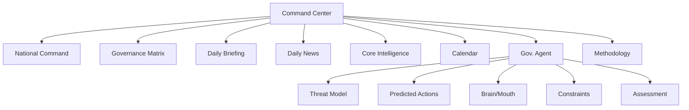
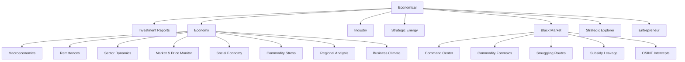
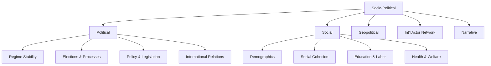
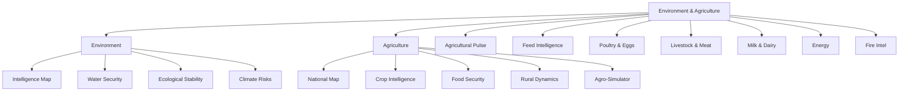
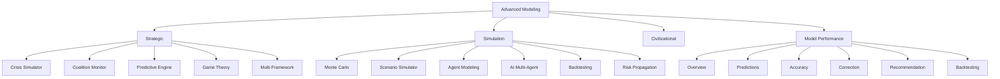
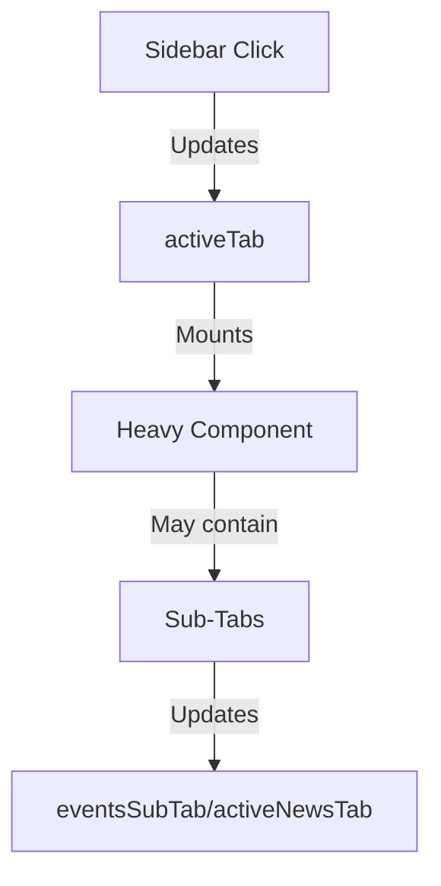
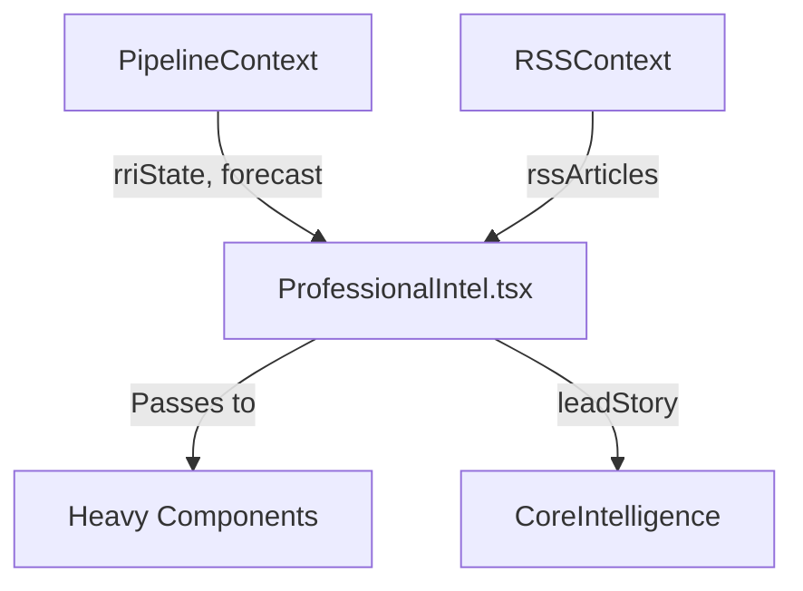

# Professional Dashboard Map

This document provides a comprehensive structural map of the `ProfessionalIntel` module (the Professional Dashboard) to aid in enhancements and navigation.

## Sidebar Navigation & Categories

The sidebar groups intelligence applications into strategic categories.

### 1. Command Center
* **National Command** (`command-center`) -> `NationalCommandCenter`
  - Main command interface with tactical alerting, system status, and operational controls
* **Governance Matrix** (`trgm`) -> `TRGMDashboard`
  - Governance risk assessment and institutional stability monitoring
* **Daily Briefing** (`briefing`) -> `DailyBriefing`
  - Executive intelligence summary with key developments and assessments
* **Daily News** (`ne`) -> `NewsFeed` (wrapped with `ModuleHeader`)
  - Real-time stream of latest regional and global intelligence signals
* **Core Intelligence** (`overview`) -> Core Overview Layout (Dashboard Home)
  - Main intelligence dashboard with tactical alerting, analytical depth, and strategic outlook
* **Calendar** (`calendar`) -> `PoliticalCalendar`
  - Political events tracking and scheduling system
* **Gov. Agent** (`govagent`) -> `GovernmentAgentPanel`
  - Government agency intelligence and coordination monitoring with the following sub-tabs:
    - **Threat Model** (`threat`) - Regime threat perception and risk profiling (e.g., UGTT mobilization, elite signals).
    - **Predicted Actions** (`actions`) - AI-generated predictions of regime responses (e.g., suppression, narrative injection).
    - **Brain/Mouth** (`brain_mouth`) - Analysis of regime communication divergence (brain: internal logic vs. mouth: public narrative).
    - **Constraints** (`constraints`) - Institutional limitations (e.g., military loyalty, economic thresholds, elite cohesion).
    - **Assessment** (`intelligence`) - Strategic evaluation of regime effectiveness, watch signals, and reflex layer activity.
* **Methodology** (`methodology`) -> (Usually triggers an action/modal)
  - Documentation and explanation of analytical methodologies



### 2. Economical
* **Investment Reports** (`reports`) -> `InvestmentIntelligenceReportGenerator`
  - Automated investment intelligence report generation system
* **Economy** (`economy`) -> `EconomyIntelligence`
  - Macro-economic indicators, fiscal monitoring, and economic risk assessment with the following sub-tabs:
    - **Macroeconomics** (`macro`) - Real-time macroeconomic indicators, GDP growth, inflation trends, fiscal health, and economic forecasting.
    - **Remittances** (`remittances`) - Analysis of remittance inflows, regional distribution, dependency metrics, and economic impact.
    - **Sector Dynamics** (`sector`) - Sector-specific performance, growth trends, employment metrics, and wage analysis.
    - **Market & Price Monitor** (`market`) - Market indicators, commodity prices, inflation drivers, and essential goods pricing.
    - **Social Economy** (`social`) - Poverty analysis, regional disparities, social safety nets, and healthcare accessibility.
    - **Commodity Stress** (`shortages`) - Commodity shortages, supply chain disruptions, and critical goods availability.
    - **Regional Analysis** (`regional`) - Regional economic comparisons, debt breakdown, and geopolitical economic risks.
    - **Business Climate** (`business`) - Economic freedom scores, FDI tracking, SME credit access, and startup ecosystem analysis.
* **Industry** (`industry`) -> `IndustrialIntelligencePanel`
  - Sector-specific industrial analysis and supply chain intelligence
* **Strategic Energy** (`strategic-energy`) -> `StrategicEnergyIntelligencePanel`
  - Energy sector intelligence, infrastructure assessment, and energy security monitoring
* **Black Market** (`black-market`) -> `BlackMarketIntelligencePanel`
  - Illicit economy monitoring, smuggling networks, and underground market analysis with the following sub-tabs:
    - **Command Center** (`command`) - Real-time black market monitoring, price divergence forensics, and shadow basket index analysis.
    - **Commodity Forensics** (`commodities`) - Commodity-specific price distortion, availability tracking, and smuggling risk assessment.
    - **Smuggling Routes** (`routes`) - Geospatial analysis of smuggling corridors, route-specific risk assessment, and predictive cascade alerts.
    - **Subsidy Leakage** (`leakage`) - Subsidy distribution analysis, leakage quantification, and fiscal impact assessment.
    - **OSINT Intercepts** (`osint`) - Automated OSINT signal monitoring, keyword velocity tracking, and real-time intercept registry.
* **Strategic Explorer** (`strategic-explorer`) -> `BusinessInvestigator`
  - Business intelligence, market opportunity analysis, and competitive landscape assessment
* **Entrepreneur** (`entrepreneur`) -> `EntrepreneurIntelligence`
  - Entrepreneurial ecosystem monitoring, startup ecosystem analysis, and SME support intelligence



### 3. Threat & Security
* **Events** (`events`) -> `EventsIntelligence`
  - Geopolitical events tracking with the following sub-tabs:
    - **News** (`news`) - Real-time event news feed, source alignment analysis, and narrative tone assessment.
    - **Engine** (`engine`) - Event clustering engine, priority scoring, and risk assessment.
    - **Timeline** (`timeline`) - Chronological event timeline visualization and temporal signal analysis.
    - **Signal** (`signal`) - Intelligence signal detection, divergence scoring, and real-time signal feed.
### 3. Threat & Security

* **Security** (`security`) -> `SecurityIntelligence`
  - National security threats, counter-terrorism, and internal security monitoring with the following sub-tabs:
    - **Strategic Readiness** (`strategic`) - National defense readiness, threat level assessment, and strategic radar analysis.
    - **Border & Migration** (`border`) - Border integrity monitoring, migration interception dynamics, and maritime security.
    - **Narcotics & Crime** (`crime`) - Drug enforcement trends, trafficking route analysis, and organized crime monitoring.
    - **Public Safety** (`safety`) - Road accident trends, accident cause analysis, and public safety metrics.
    - **Cyber Warfare** (`cyber`) - Cyber incident trends, threat actor profiling, and critical infrastructure protection.
    - **Prison System** (`prison`) - Prison occupancy analysis, radicalization trends, and incident monitoring.
    - **Police Operations** (`police`) - Police deployment analysis, use of force trends, and tactical operations.

* **Clusters** (`clusters`) -> `EventClusters`
  - Event clustering and pattern recognition with the following sub-tabs:
    - **Geospatial** (`geospatial`) - Geographic clustering of events and hotspot detection.
    - **Temporal** (`temporal`) - Time-based clustering of events and trend analysis.
    - **Narrative** (`narrative`) - Narrative clustering and divergence detection.
    - **Risk** (`risk`) - Risk-based clustering and escalation prediction.

* **Actor Network** (`actor-network`) -> `ActorNetworkIntelligence`
  - Actor mapping and influence analysis with the following sub-tabs:
    - **Influence** (`influence`) - Influence mapping and relationship analysis.
    - **Posture** (`posture`) - Actor posture tracking and strategic alignment.
    - **Coalitions** (`coalitions`) - Coalition dynamics and alliance mapping.
    - **Threat** (`threat`) - Threat actor profiling and risk assessment.

* **Radicalisation** (`radicalisation`) -> `RadicalisationIntelligence`
  - Radicalization processes, extremist group monitoring, and deradicalization program assessment with the following sub-tabs:
    - **Gradient** (`gradient`) - Escalation trajectory tracking (Levels 0-5) and intervention windows.
    - **Narrative Poles** (`poles`) - Analysis of dominant ideological frames (e.g., Transnational Solidarity, Anti-Systemic) and pole synergy.
    - **Pipeline** (`pipeline`) - Radicalization stages (e.g., War Exposure → Emotional Activation → Identity Alignment).
    - **EQ Impact** (`equations`) - Impact of Radicalisation Pressure Index (RPI) on core RRI equations (EQ.3, EQ.4, EQ.19).
    - **Intervention** (`intervention`) - Level-specific counter-radicalization strategies (e.g., inoculation, narrative substitution).
    - **Geographic** (`geographic`) - Regional RPI distribution and risk hotspots (e.g., Gafsa, Kasserine).

* **Cognitive Warfare** (`cognitive`) -> `CognitiveWarfare` or `CognitiveSecurityIntelligence`
  - Information operations, disinformation campaigns, and cognitive security threats with the following sub-tabs:
    - **Narrative** (`narrative`) - Narrative warfare analysis and propaganda detection.
    - **Amplification** (`amplification`) - Information amplification tracking and velocity analysis.
    - **Targets** (`targets`) - Target audience profiling and vulnerability assessment.
    - **Countermeasures** (`countermeasures`) - Counter-disinformation strategies and inoculation.

```mermaid
graph TD
    A[Threat & Security] --> B[Events]
    A --> C[Security]
    A --> D[Clusters]
    A --> E[Actor Network]
    A --> F[Radicalisation]
    A --> G[Cognitive Warfare]

    B --> B1[News]
    B --> B2[Engine]
    B --> B3[Timeline]
    B --> B4[Signal]
    B --> B5[Temporal]
    B --> B6[RTEE]

    C --> C1[Strategic Readiness]
    C --> C2[Border & Migration]
    C --> C3[Narcotics & Crime]
    C --> C4[Public Safety]
    C --> C5[Cyber Warfare]
    C --> C6[Prison System]
    C --> C7[Police Operations]

    F --> F1[Gradient]
    F --> F2[Narrative Poles]
    F --> F3[Pipeline]
    F --> F4[EQ Impact]
    F --> F5[Intervention]
    F --> F6[Geographic]

    G --> G1[Narrative]
    G --> G2[Amplification]
    G --> G3[Targets]
    G --> G4[Countermeasures]
```


* **Social** (`social`) -> `SocialIntelligence`
  - Social friction monitoring, psychological stress analysis, and migration dynamics with the following sub-tabs:
    - **Cohesion** (`cohesion`) - Public sentiment analysis, youth rage index, and social stability tracking.
    - **Migration** (`migration`) - Diaspora dynamics, brain drain analysis, labor migration, and policy governance.
      - **Diaspora** (`diaspora`) - Geographic concentration, economic impact, and remittance analysis.
      - **Brain Drain** (`braindrain`) - Engineer and medical exodus, PhD emigration intent, and R&D impact.
      - **Labor** (`workers`) - Youth emigration aspiration, seasonal labor flows, and return migration.
      - **Policy** (`policy`) - Migration governance framework, EU-Tunisia deal analysis, and RRI model impact.
    - **Family** (`family`) - Demographic vitality, divorce trends, regional breakdowns, and family dynamics.
    - **Health** (`health`) - Chronic disease prevalence, healthcare fund analysis, addiction metrics, and rehab capacity.

### 4. Social Observatory
* **Societal Fracture** (`societal-fracture`) -> `SocietalFractureMonitor`
  - Social cohesion monitoring, inequality tracking, and social tension indicators

### 5. Socio-Political
* **Political** (`political`) -> `PoliticalIntelligence`
  - Political system analysis, regime stability assessment, and political process monitoring with the following sub-tabs:
    - **Regime Stability** (`stability`) - Assessment of political stability, institutional resilience, and governance risks.
    - **Elections & Processes** (`elections`) - Election monitoring, political participation, and electoral integrity analysis.
    - **Policy & Legislation** (`policy`) - Tracking of legislative developments, policy changes, and regulatory impacts.
    - **International Relations** (`relations`) - Diplomatic relations, foreign policy analysis, and geopolitical positioning.
* **Social** (`social`) -> `SocialIntelligence`
  - Social dynamics, demographic trends, and societal behavior analysis with the following sub-tabs:
    - **Demographics** (`demographics`) - Population trends, age distribution, and migration patterns.
    - **Social Cohesion** (`cohesion`) - Social tension monitoring, inequality metrics, and community resilience.
    - **Education & Labor** (`labor`) - Education trends, labor market dynamics, and unemployment analysis.
    - **Health & Welfare** (`health`) - Healthcare accessibility, public health trends, and social welfare programs.
* **Geopolitical** (`geopolitical`) -> `GeopoliticalIntelligence`
  - International relations, regional geopolitics, and foreign policy analysis
* **Int'l Actor Network** (`geopolitical-network`) -> `GeopoliticalNetworkGraph`
  - Visual network mapping of international actors and their relationships
* **Narrative** (`narrative`) -> `NarrativeIntelligence`
  - Information environment analysis, propaganda detection, and narrative intelligence



### 6. Environment & Agriculture
* **Environment** (`environment`) -> `EnvironmentalIntelligence`
  - Environmental monitoring, climate risk assessment, and natural resource management with the following sub-tabs:
    - **Intelligence Map** (`ALL`) - Sovereign environmental risk map with dynamic layers (Water Stress, Fire Risk, Erosion, Aquifer Depletion).
    - **Water Security** (`WATER`) - Hydric stress analysis, dam reserves, aquifer depletion, and desalination lifecycle.
    - **Ecological Stability** (`ECOLOGY`) - Desertification monitoring, forest cover loss, soil erosion, and biodiversity health.
    - **Climate Risks** (`CLIMATE`) - Temperature anomalies, heatwave frequency, rainfall deficits, and coastal vulnerability.
* **Agriculture** (`agriculture`) -> `AgriIntelDashboard`
  - Agricultural sector intelligence, food security monitoring, and rural development analysis with the following sub-tabs:
    - **National Map** (`MAP`) - Geospatial agricultural risk assessment with layers for crop stress, rainfall, and soil moisture.
    - **Crop Intelligence** (`CROPS`) - Yield forecasting for wheat, olives, and barley; fertilizer cost tracking; and export dynamics.
    - **Food Security** (`FOOD`) - Bread Crisis Index (BCI), cereal import dependency, and food subsidy burden analysis.
    - **Rural Dynamics** (`RURAL`) - Rural unrest monitoring, migration patterns, and smallholder farmer credit stress.
    - **Agro-Simulator** (`SIM`) - Integration of `AgroCrisisModel` and `AgroScenarioSimulator` for agricultural shock testing.
* **Agricultural Pulse** (`agri-pulse`) -> `NationalAgriculturalPulse`
  - Real-time agricultural production monitoring and food supply chain intelligence
* **Feed Intelligence** (`feed-hub`) -> `FeedIntelligenceHub`
  - Animal feed industry analysis, supply chain monitoring, and livestock nutrition intelligence
* **Poultry & Eggs** (`poultry`) -> `PoultryEggsIntelligence`
  - Poultry production monitoring, egg market analysis, and avian health intelligence
* **Livestock & Meat** (`livestock`) -> `LivestockMeatIntelligence`
  - Livestock population tracking, meat production analysis, and animal health monitoring
* **Milk & Dairy** (`dairy`) -> `MilkDairyIntelligence`
  - Dairy industry monitoring, milk production analysis, and dairy product safety intelligence
* **Energy** (`energy`) -> `EnergyIntelligence`
  - Energy sector monitoring, power generation analysis, and energy infrastructure intelligence
* **Fire Intel** (`fire`) -> `FireIntelligencePanel`
  - Fire incident monitoring, emergency response coordination, and fire risk assessment



### 7. Advanced Modeling
* **Strategic** (`strategic`) -> `StrategicModeling`
  - Long-term strategic forecasting, scenario planning, and policy impact analysis with the following sub-tabs:
    - **Crisis Simulator** (`crisis`) - Event-driven regime stability modeling (IMF failure, subsidy cuts, strikes).
    - **Coalition Monitor** (`coalition`) - Institutional and elite game theory analysis of political coalitions.
    - **Predictive Engine** (`predictive`) - Statistical forecasting of RRI/P_rev trajectories and velocity.
    - **Game Theory** (`gametheory`) - Strategic actor posture matrix and Nash equilibrium modeling.
    - **Multi-Framework** (`multiframework`) - Synthesis of Fragility, Conflict, Strategic Pressure, Info War, and Cascade models.
* **Simulation** (`simulation`) -> `SimulationIntelligence`
  - Interactive simulation environment for policy testing and crisis scenario modeling with the following sub-tabs:
    - **Monte Carlo** (`monte-carlo`) - Statistical distribution analysis of risk variables.
    - **Scenario Simulator** (`scenario`) - Multi-variable parameter matrix for real-time P_rev gauging.
    - **Agent Modeling** (`agent`) - Tipping point detection through population-based agent simulation.
    - **AI Multi-Agent** (`ai-multi`) - Persona-based AI analyst consensus and dissent modeling.
    - **Backtesting** (`backtesting`) - Historical calibration and model performance drift analysis.
    - **Risk Propagation** (`propagation`) - Visualizing the spread of systemic shocks through connected nodes.
* **Civilizational** (`civilizational`) -> `CivilizationalAnalysis`
  - Long-term civilizational trend analysis and cultural evolution patterns with the following sub-tabs:
    - **Dalio Cycle** (`dalio`) - Ray Dalio's Big Cycle debt and power dynamics analysis.
    - **Haupt Phases** (`haupt`) - Civilizational life-cycle phase monitoring.
    - **Freedom Cycle** (`freedom`) - Institutional erosion and civil liberty oscillation tracking.
    - **Ideological Shifts** (`ideology`) - Long-term tracking of national identity and narrative evolution.
* **Model Performance** (`performance`) -> `ModelPerformance`
  - AI model accuracy tracking, performance metrics, and validation results with the following sub-tabs:
    - **Overview** (`overview`) - Model calibration assessment, accuracy by time horizon, and best/worst predicted variables.
    - **Predictions** (`predictions`) - Historical prediction records, evaluation status, and accuracy scoring.
    - **Accuracy** (`accuracy`) - Hit rate analysis by variable, false positive/negative rates, and systematic bias detection.
    - **Correction** (`corrections`) - Analyst correction workflow, missed variable tracking, and weight change suggestions.
    - **Recommendation** (`recommendations`) - Surfaced weight change recommendations and parameter adjustment proposals.
    - **Backtesting** (`backtesting`) - Historical calibration, model drift analysis, and performance trend tracking.



## Shared Layout Elements

* **Top Header (`ProfessionalHeader`)**:
  - Contains main navigation elements (sidebar toggle, branding, system status indicators)
  - Global search functionality
  - Live metrics display (RRI Index, P(Revolution), FX Reserves)
  - Action buttons (Home, Data Pipeline, AI Analyst, Generate AI Report, Calendar, Intelligence Terminal, Pipeline Debugger, Help/Methodology)
  - Notification bell
  - Weather mini-widget
  - Time and date display (UTC)

* **Terminal (`Terminal`)**:
  - Slide-up/overlay terminal for intelligence commands and system operations
  - Controlled by `boolean: isTerminalOpen` state

* **Calendar Overlay (`CalendarOverlay`)**:
  - Overlay schedule and calendar view
  - Controlled by `boolean: showCalendar` state

* **AI Analysis Modal/Panel (`IntelligenceBriefPanel`)**:
  - Displayed when `aiAnalysis` is active in the `overview` or through global actions
  - Presents AI-generated intelligence briefings and analysis

## Contextual Details of the `overview` (Core Intelligence) Page

The Core Intelligence Overview is the landing page of the professional dashboard and renders the following layers:

### Layer 1: Tactical Alerting & Status
- **SystemCommandCenter** or **ObservabilityDashboard** (RTEE integration)
  - Real-time system monitoring and operational status
- Live synchronization pulse indicators
  - Visual indicators showing data pipeline health and update frequency

### Layer 2: Main Dashboard Grid
- **Intelligence Spotlight Carousel**:
  - Rotating display of key intelligence metrics:
    * UGTT Strike Risk
    * FX Reserve Runway
    * Cascade Risk
    * Pattern Match HPS
- **Lead Story Banner**:
  - Parses `leadStory` for SEV-level alerts and global news priorities
  - Highlights highest severity intelligence items
- **Regional Risk Choropleth Map**:
  - Displays geographical heat mapping (`activeLayer="Regional Risk"`)
  - Shows risk distribution across Tunisian governorates

### Layer 3: Analytical Depth
- **Forecast & Calibration**:
  - Recharts LineChart for RRI Trend Analysis (historical + forecast)
  - 14-Day Cascade Forecast BarChart showing probability distribution
- **Intelligence Brief (ELEVATED)**:
  - Situational summary of current conditions
  - Key Developments bullet points
  - Assessment of risk levels and trends
  - Predicted Regime Response matrix
- **Strategic Outlook**:
  - AI-generated or context-provided strategic narrative
  - Long-term perspective on evolving situations
- **Key Intelligence Questions (KIQs)**:
  - Dynamic list of critical issues being tracked
  - Each KIQ shows: ID, Status, Confidence level, Impact assessment, and the specific question
- **Regional Hotspots**:
  - Heatmap metrics for specific regions like Sfax, Gafsa, Kasserine
  - Shows risk level, reasoning, and trend direction for each hotspot
- **Scenario Probability (30-day horizon)**:
  - Percentage breakdown of likely future paths
  - Visual bar representations of scenario likelihoods
- **Actor Posture Matrix**:
  - Listing of key actors, their posture (MOBILIZING/CONSOLIDATING), influence level, and trend direction
- **Live Signal Intelligence Footer**:
  - Ticker (`LiveSignalFeed`) at the bottom of the analytical depth section
  - Shows real-time intelligence signals with filtering capabilities

## General Component Architecture

* **State Management**: 
  - **Zustand and Context Providers**: 
    - `PipelineContext`: Centralizes intelligence data (RRI, MII, forecast, AI analysis).
    - `RSSContext`: Aggregates news articles for `NewsFeed` and `RealTimeNewsFeed`.
  - **Local State**: Manages UI controls (sidebar, tabs, modals) via `useState`.
  - **Key States**:
    - `activeTab`: Determines the mounted "heavy component" (e.g., `"overview"`, `"economy"`).
    - Sub-tabs: `eventsSubTab`, `activeNewsTab` for nested navigation.

* **Routing Strategy**: 
  - **Primary Routing**: Handled via `activeTab` local state in `ProfessionalIntel.tsx` (lines 629-671).
  - **Sub-Tab Routing**: Managed separately for complex modules (e.g., `EventsIntelligence`).
  - **Mobile-Specific States**: Responsive behavior for sidebar and modals.

* **UI/Styles**: 
  - **Tailwind CSS**: Uses `glass`, `backdrop-blur`, and conditional border rendering (e.g., `text-intel-red` for CRITICAL risk).
  - **Typography**: Mono and sans scales for hierarchical information presentation.
  - **Dark Theme**: Intelligent color coding for risk levels (red/orange/cyan).

* **Graphs**: 
  - **Library**: `recharts` for responsive visualizations.
  - **Types**: Line charts (trend analysis), bar charts (comparative data), gauges (risk thresholds).

* **Icons**: 
  - **Library**: `lucide-react` for consistent visual language.
  - **Usage**: Sidebar navigation, headers, and status indicators.

* **Data Flow**:
  - **PipelineContext**: Provides core intelligence data (RRI, MII, economic indicators, social metrics).
  - **RSSContext**: Handles news feed aggregation and processing.
  - **Services Layer**: External API calls (Supabase, Gemini AI, etc.).
  - **Component Subscription**: Components update based on context changes.

---

### Routing and State Management

#### `activeTab` State Flow
- **Purpose**: Determines the currently mounted "heavy component" in the main view.
- **Type**: `string` (e.g., `"overview"`, `"economy"`).
- **Initial State**: `"command-center"` (line 671).
- **State Management**: Local `useState` in `ProfessionalIntel.tsx`.
- **Trigger**: Updated via sidebar navigation buttons (lines 1089-1092).

#### Sub-Tab State
- **Purpose**: Manages nested navigation within complex modules (e.g., `EventsIntelligence`).
- **Examples**:
  - `eventsSubTab`: Controls tabs in `EventsIntelligence` (e.g., `"news"`, `"engine"`).
  - `activeNewsTab`: Controls tabs in `NewsFeed` (e.g., `"feed"`, `"signal"`).
- **State Management**: Local `useState` in `ProfessionalIntel.tsx` (lines 672-675).

#### State Flow Diagram



> **Visual Reference**: The diagram below illustrates the state flow and routing logic in the `ProfessionalIntel` dashboard.

#### Conditional Rendering Logic
- **Key Files**: `ProfessionalIntel.tsx` (lines 1142-2344).
- **Example**:
  ```tsx
  {activeTab === "overview" ? <CoreIntelligence /> : activeTab === "economy" ? <EconomyIntelligence /> : ...}
  ```
- **Dynamic Imports**: Heavy components are imported at the top (lines 70-122) and rendered conditionally.

---

### Dynamic UI Behaviors

#### Pulse Effects and Animations
- **Purpose**: Visual feedback for real-time data updates and transitions.
- **Implementation**:
  - **Pulse Effects**: Tailwind CSS `animate-pulse` class (e.g., line 1036 for "SYSTEM LINK").
  - **Animations**: `motion` (Framer Motion) for transitions (e.g., sidebar expansion/collapse).
  - **Examples**:
    - RRI score (line 1275).
    - Live sync indicators (line 1753).
    - Lead story severity (line 1707).

#### Risk Color Coding
- **Purpose**: Visual risk stratification (CRITICAL/HIGH/LOW).
- **Implementation**:
  - Tailwind CSS classes (e.g., `text-intel-red`, `text-intel-orange`).
  - Dynamic assignment based on thresholds (e.g., line 1275 for RRI).

---

### Data Flow and Context

#### Context Providers
- **`PipelineContext`**:
  - **Purpose**: Centralizes intelligence data (RRI, MII, forecast, AI analysis).
  - **Usage**: `usePipeline()` hook (line 617).
  - **Key Data**:
    - `rriState`: Revolutionary Risk Index and derivatives (e.g., `p_rev`).
    - `forecast`: Predictive models (e.g., 14-day cascade probability).
    - `aiAnalysis`: AI-generated summaries and risk assessments.
- **`RSSContext`**:
  - **Purpose**: Aggregates news articles for `NewsFeed` and `RealTimeNewsFeed`.
  - **Usage**: `useRSS()` hook (line 628).

#### Data Flow Diagram


---

### Component Hierarchy

#### Core Intelligence Overview (`activeTab="overview"`)
- **Layers**:
  1. **Tactical Alerting**:
     - RRI score (lines 1270-1297).
     - Gauges (P(Revolution), Cascade Risk, Pattern Match) (lines 1302-1383).
     - Ticker metrics (FX reserves, UGTT, protests) (lines 1387-1449).
  2. **Active Intelligence**:
     - Spotlight carousel (lines 1499-1700).
     - Lead story banner (lines 1703-1742).
     - Regional risk map (lines 1746-1766).
  3. **Analytical Depth**:
     - Forecast & calibration (lines 1778-1965).
     - Intelligence brief (lines 1970-2090).
     - Strategic outlook (lines 2093-2104).
     - KIQs, hotspots, scenarios, actor matrix (lines 2107-2253).
